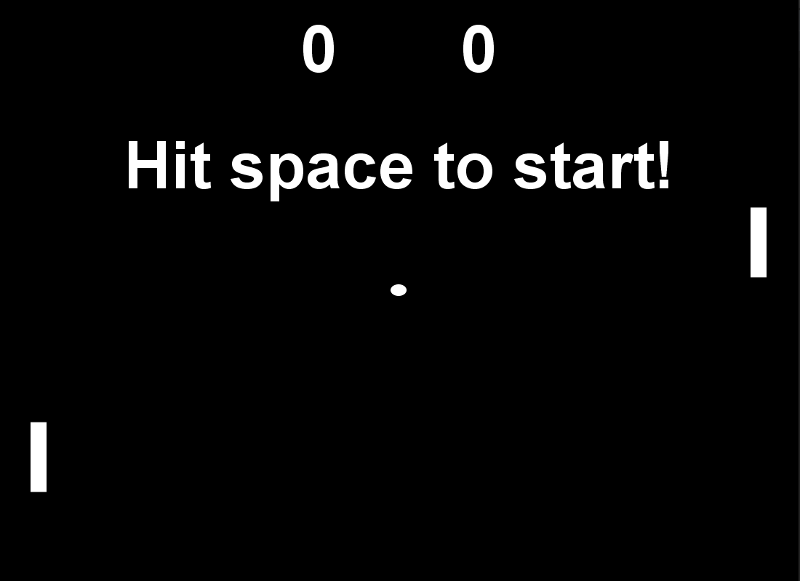
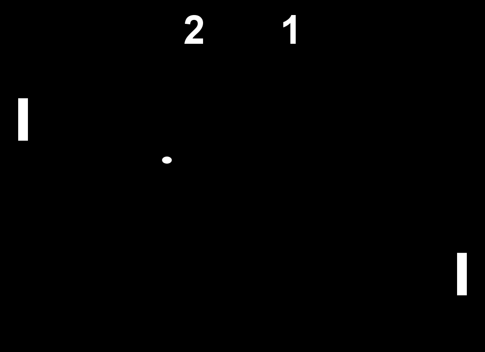

# Pong
## Introduction
A project I made awhile back that allows you to play the game Pong. Controls are *w* and *s* for the left player while
the right player is controlled via the up and down keys. The first person to 3 wins the game.
## The UI
### Starting Screen

### In Game

### Game Over

## To Run
    java Pong